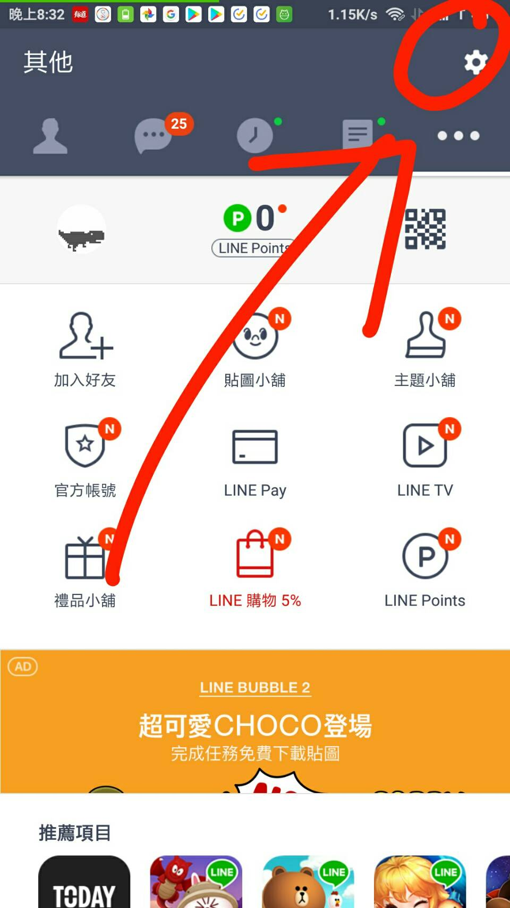

# 操作步驟
> 刪除線代表已經完成的部分，其他則是要麻煩妳幫媽媽的步驟
1. ~~備份舊手機 LINE 文字訊息~~
2. ~~備份舊手機電話號碼與 LINE 聯絡人資訊~~
3. 備份**舊手機** LINE 儲存下來的圖片
    1. 如果尚未備份好，會出現下圖 :
        * 
    2. 如果備份完成，會出現下圖，可以繼續執行第四步
        * 
4. 登入新手機 LINE
5. 還原新手機的訊息
    1. 
    2. 
    3. 
    4. 
    5. 
6. 相片則是都備份到 Google 相簿上，之後要查看都是開啟下面那個 App
    * 